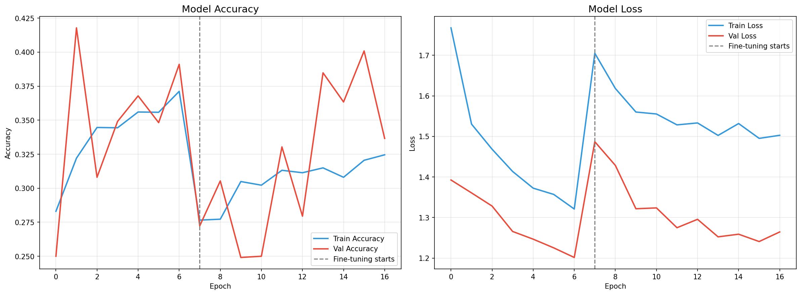
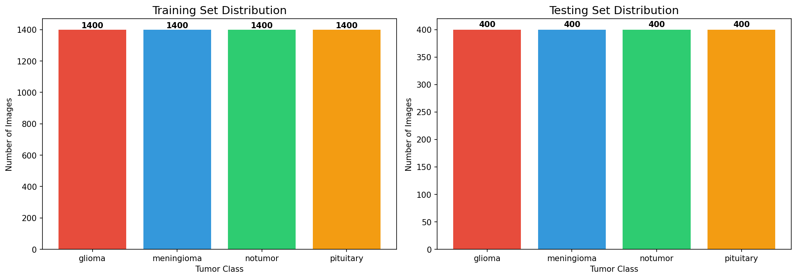
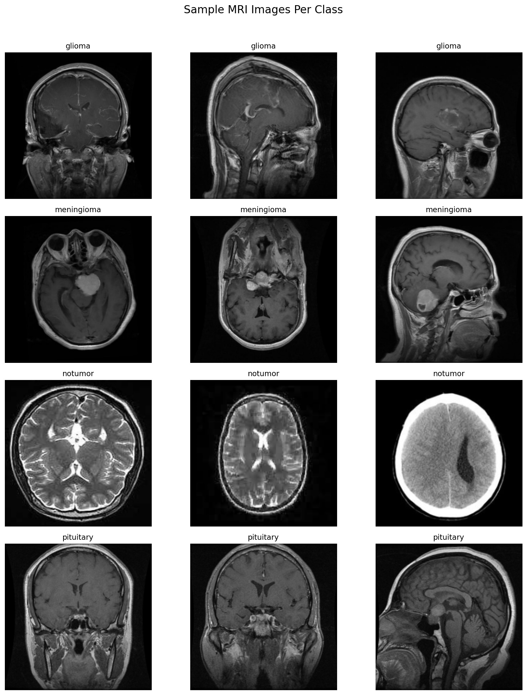
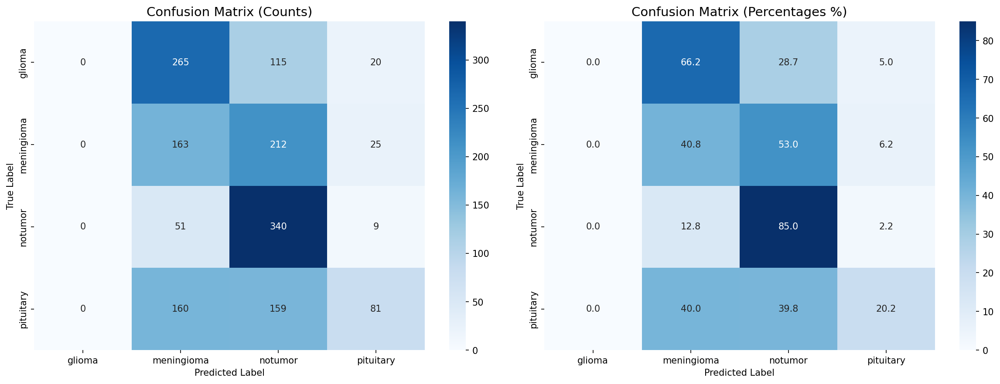
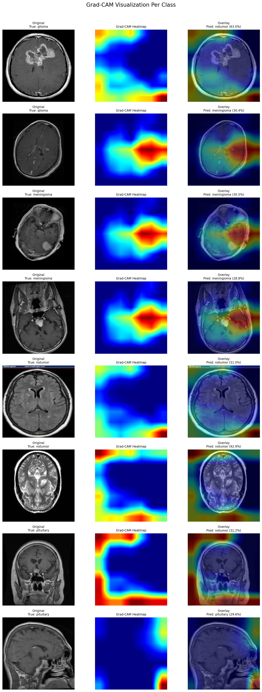

# 🧠 Brain Tumor Detection & Classification

[](https://huggingface.co/spaces/Sruthi-R/brain-tumor-classifier)

A deep learning project that classifies brain MRI scans into four categories using **EfficientNetB0** with transfer learning and fine-tuning. Built end-to-end in a single Jupyter notebook, fully runnable on Google Colab with GPU.



---

## 📋 Overview

| Feature | Details |
|---------|---------|
| **Model** | EfficientNetB0 (pretrained on ImageNet) |
| **Task** | 4-class brain tumor classification |
| **Classes** | Glioma, Meningioma, No Tumor, Pituitary |
| **Input Size** | 224 × 224 RGB |
| **Training** | 2-phase: feature extraction → fine-tuning |
| **Explainability** | Grad-CAM heatmap visualization |

---

## 🏗️ Architecture

```
Input (224×224×3)
    │
    ▼
EfficientNetB0 (ImageNet weights)
    │
    ▼
Global Average Pooling 2D
    │
    ▼
BatchNorm → Dropout(0.3) → Dense(256, ReLU)
    │
    ▼
BatchNorm → Dropout(0.3) → Dense(4, Softmax)
    │
    ▼
Output: [glioma, meningioma, notumor, pituitary]
```

### Two-Phase Training Strategy

- **Phase 1 — Feature Extraction:** EfficientNetB0 frozen, only top layers trained (lr=1e-3, up to 15 epochs)
- **Phase 2 — Fine-Tuning:** Last 30 layers of EfficientNetB0 unfrozen, trained with low lr (lr=1e-5, up to 10 epochs)

---

## 📊 Results

### Class Distribution



### Sample MRI Images



### Confusion Matrix



### Grad-CAM Visualizations

Grad-CAM highlights the regions the model focuses on when making predictions, providing interpretability for clinical relevance.



---

## 📁 Project Structure

```
brain-tumor-detection/
├── Brain_Tumor_Detection.ipynb   # Main notebook (with outputs)
├── brain_tumor_detection.py      # Script version with cell markers
├── README.md
├── .gitignore
├── class_distribution.png        # Class distribution bar chart
├── confusion_matrix.png          # Confusion matrix (counts + %)
├── gradcam_results.png           # Grad-CAM visualizations
├── sample_images.png             # Sample MRI images per class
├── training_curves.png           # Accuracy & loss curves
└── model/
    ├── brain_tumor_classifier.keras
    └── brain_tumor_classifier.h5
```

---

## 🚀 Quick Start

### Run on Google Colab (Recommended)

1. Upload `Brain_Tumor_Detection.ipynb` to [Google Colab](https://colab.research.google.com/)
2. Set runtime to **GPU**: `Runtime → Change runtime type → GPU (T4)`
3. Run all cells — the only manual step is entering your Kaggle API credentials when prompted
4. All plots, model files, and evaluation results are generated automatically

### Get Kaggle API Key

1. Go to [kaggle.com/settings](https://www.kaggle.com/settings)
2. Scroll to **API** section → click **Create New Token**
3. Note your username and the API key

---

## 📂 Dataset

**Brain Tumor MRI Dataset** by Masoud Nickparvar ([Kaggle](https://www.kaggle.com/datasets/masoudnickparvar/brain-tumor-mri-dataset))

| Split | Glioma | Meningioma | No Tumor | Pituitary | Total |
|-------|--------|------------|----------|-----------|-------|
| Train | 1,321 | 1,339 | 1,595 | 1,457 | 5,712 |
| Test | 300 | 306 | 405 | 300 | 1,311 |

---

## 🔧 Tech Stack

- **Python 3.10+**
- **TensorFlow / Keras** — model building & training
- **EfficientNetB0** — pretrained backbone (transfer learning)
- **OpenCV** — image preprocessing & Grad-CAM overlay
- **Matplotlib / Seaborn** — visualizations
- **scikit-learn** — classification report & confusion matrix
- **Kaggle API** — dataset download

---

## 🔬 Key Features

- ✅ **Transfer Learning** — leverages ImageNet-pretrained EfficientNetB0
- ✅ **Two-Phase Training** — feature extraction then selective fine-tuning
- ✅ **Data Augmentation** — rotation, shift, zoom, horizontal flip
- ✅ **Early Stopping & LR Scheduling** — prevents overfitting
- ✅ **Grad-CAM Explainability** — visualize model attention regions
- ✅ **Complete Evaluation** — confusion matrix, classification report, per-class metrics

---

## 📄 License

This project is for educational and research purposes.

Dataset: [Brain Tumor MRI Dataset](https://www.kaggle.com/datasets/masoudnickparvar/brain-tumor-mri-dataset) by Masoud Nickparvar (CC BY-SA 4.0)
